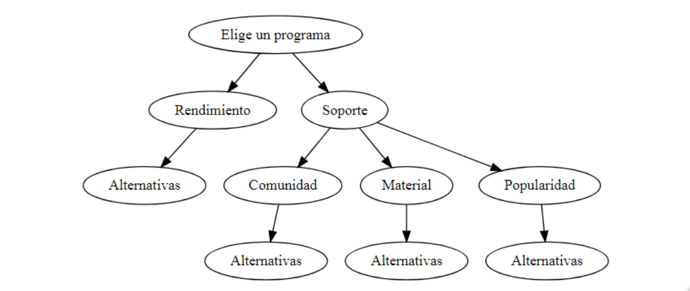
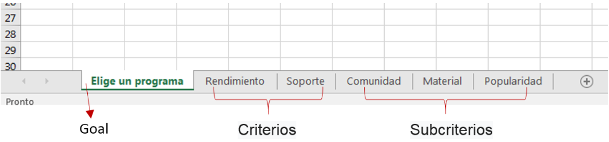
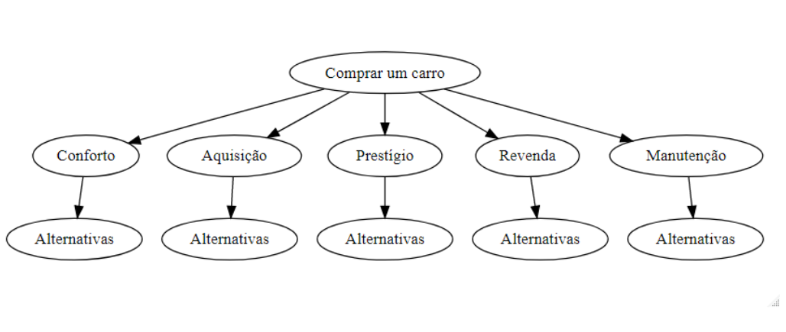
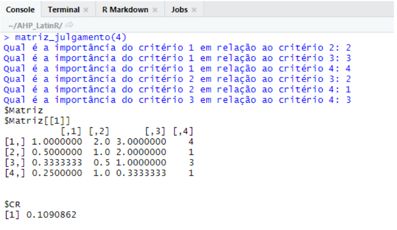

```{r, include = FALSE}
knitr::opts_chunk$set(
  collapse = TRUE,
  comment = "#>"
)
```


O processo de tomada de decisão sob incerteza tem mostrado importância em qualquer situação da vida
pessoal ou profissional de um indivíduo, uma vez que o ser humano é levado a tomar decisões em grande parte
do seu tempo de vida. 

O processo Analytic Hierarchy Process (AHP), baseado em matemática e psicologia, foi desenvolvido
na década de 1970 pelo professor Thomas Saaty. O AHP pode ser classificado como o mais conhecido e
utilizado dos métodos de análise multicritério cuja modelagem se divide em três etapas: construção dos níveis
hierárquicos, definição das prioridades através de julgamentos paritários dos critérios estabelecidos e avaliação
da consistência lógica dos julgamentos paritários. 

O pacote AHP apresenta a implementação do Método de AHP utilizando-se a linguagem computacional R para automatização do método e apresentação dos resultados de maneira intuitiva para melhorar a experiência do usuário.

## Instalando Pacote

Para instalar o pacote AHP você deverá instalar primeiro o pacote devtools que possibilita  a instalação de pacotes armazenados no github

Em seguida faça a instalação do pacote AHP de acordo com o script

```{r eval=FALSE}
devtools::install_github('Lyncoln/AHP2')
```

Após a instalação é só chamar o pacote:

```{r}
library(AHP)
```

## Construção da Hierarquia do Problema

A primeira etapa do método AHP é a construção de hierarquia, identificando: critérios; subcritérios(quando houverem); e, alternativas. Estes elementos formam a estrutura da hierarquia.

O pacote apresenta 4 exemplos para auxiliar no entendimento de como os dados devem ser inseridos.
Os dados de exemplo são BD1, BD2, BD3 e BD4.


### Organização dos dados no excel

Para exemplificar como devem ser inseridos os dados no excel será utilizada a seguinte árvore de decisão



O arquivo excel a ser utilizado no pacote deve seguir a seguinte formatação: a primeira planilha apresenta a matriz com a importancia dos critérios em relação ao foco principal ou do objetivo geral, em seguida são apresentadas as planilhas que contém a importância das alternativas em relação aos critérios (caso o critério apresente subcritérios a matriz de critérios apresentará a importância dos subcritérios em relação ao cirtério), e por último (caso tenha) são as matrizes que contém a importância das alternativas em relação aos subcritérios. Na imagem a seguir, que apresenta um exemplo para a decisão de uma melhor linguagem de programação, a primeira planilha contém a matriz do objetivo geral, as duas planilhas seguintes contém as matrizes de comparação dos critérios (é criada uma planilha para cada comparação das alternativas em relação aos critérios), em seguida são apresentadas as matrizes em relação aos subcritérios. Os subcritérios devem seguir a mesma ordem apresentada nos critérios, isto é, os subcritérios do primeiro critério devem vir primeiro, em seguida os do segundo critério e assim por diante.




### Foco Principal

O exemplo a ser apresentado será o contido em BD1. Neste encontra-se o exemplo de aquisição de um carro popular "zero", que será submetido as seguintes condições:

  •Circular aproximadamente 60 Km/dia no meio urbano, em vias asfaltadas de uma cidade com temperatura média de 29 ºC e que tem trânsito intenso.
  
### Alternativas viáveis

Considere o conjunto de alternativas viáveis $A = A_1,A_2,...,A_n$. Ou seja: dado um grupo de "condições de contorno" ou quesitos mínimos, estabelecer um grupo de alternativas que satisfaçam a tais condições ou quesitos.

No problema de escolha de um automóvel, fazem parte de A apenas aqueles automóveis que estejam disponíveis no mercado, a um preço acessível ao decisor.

Neste exemplo considera-se 3 alternativas viáveis que denominaremos $A_1,A_2,A_3$.

### Identificação do conjunto de critérios

Vamos considerar que o decisor determinou os seguintes critérios na resolução do problema da aquisição do carro: Conforto(CF), Custo de Aquisição(AQ), Prestígio(PS), Preço de Revenda(RV) e Custo de Manutenção(MA).



### Coleta do julgamento de valor

Nesta etapa o decisor deverá consultar avaliadores especialistase coletar a opnião dos mesmos sobre comparações paritárias dos critérios à luz do objetivo e das suas alternativas apresentadas:

• Avaliação da importancia dos critérios em relação ao foco principal ou do objetivo geral;

• Avaliação do desempenho das alternativas em relação aos critérios.

Deve-se buscar desenvolver mecanismos simples e de fácil entendimento para que o avaliador possa se concentrar especificamente na emissão dos julgamentos quanto as importâncias relativas entre:

• Conforto e Custo de Aquisição;

• Conforto e Prestígio;

• Conforto e Preço de Revenda;

• Conforto e Custo de Manutenção;

• Custo de Aquisição e Prestígio;

• Custo de Aquisição e Preço de Revenda;

• Custo de Aquisição e Custo de Manutenção;

• Prestígio e Preço de Revenda;

• Prestígio e Custo de Manutenção;

• Preço de Revenda e Custo de Manutenção

Esses julgamentos irão gerar um matriz paritária dos critérios à luz dos objetivos. Essa matriz terá dimensão 5x5 pois são 5 critérios neste problema como pode ser visto ao utilizar o comando:

```{r}
BD1[1]
```


Além disso será necessário obter uma matriz paritária das alternativas à luz de cada um dos critérios do
problema, ou seja, emissão dos julgamentos quanto as importâncias relativas entre:

• A1 e A2;

• A1 e A3;

• A2 e A3.

Sujeitas aos critérios Conforto (CF), Custo de aquisição (AQ), Prestígio (PS), Preço de revenda (RV) e Custo de manutenção (MA).

Esses julgamentos irão gerar 5 matrizes paritárias das alternativas à luz dos critérios. Cada matriz terá
dimensão 3x3 pois são 3 alternativas neste problema como pode ser visto ao utilizar o comando:

```{r}
BD1[-1]
```

### Organizando os dados

O pacote supõe que cada uma destas 6 matrizes paritárias devem estar organizadas em um arquivo com
extensão xlsx em que:

• a primeira planilha denominada Objetivo corresponda a Matriz (5x5) referente ao objetivo ou foco do
problema.

• a segunda planilha denominada CF corresponda a Matriz (3x3) referente ao critério Conforto;

• a terceira planilha denominada AQ corresponda a Matriz (3x3) referente ao critério Custo de Aquisição;

• a quarta planilha denominada PS corresponda a Matriz (3x3) referente ao critério Prestígio;

• a quinta planilha denominada RV corresponda a Matriz (3x3) referente ao critério Preço de Revenda;

• a sexta planilha denominada MA corresponda a Matriz (3x3) referente ao critério Custo de Manutenção;


É importante que o arquivo de dados esteja organizado conforme descrito acima, pois as funções foram
construídas supondo essa estrutura de dados.

### Matriz de Paridade ou Matriz de Julgamento

As matrizes construídas acima são chamadas de matrizes julgamento, nelas estão representados o quanto uma alternativa é melhor que outra. No exemplo pode-se observar que o carro $A_1$ é avaliado em 1/3 do carro $A_2$ em relação ao critério de Conforto(CF), enquanto o conforto do carro $A_2$ é avaliado em 3 vezes mais do que o carro $A_1$. Esses julgamentos precisam apresentar certa consistência. Para avaliar a consistência das matrizes de julgamento utiliza-se a função CR. Nesta função é inserida a matriz de julgamentos e ela retorna a inconsistência da matriz, se o valor for maior que 0.1 a matriz é inconsistente e deve ser refeita.

```{r}
CR(BD1[[2]])
```

Para calcular o nível de inconsistência de várias matrizes de uma única vez basta as matrizes estarem alocadas em uma lista e realizar o seguinte comando

```{r}
lapply(BD1, function(x) CR(x))
```


### Criando matrizes de paridade e testando sua consistência

Para criar as matrizes de julgamento e testar sua inconsistência pode-se utilizar a função matriz_julgamento. Ela apresenta três argumentos, o primeiro argumento (qtd_comparacoes) refere-se ao número de alternativas que serão comparadas. O segundo argumento (CR) refere-se a realizar ou não o cálculo da inconsistência da matriz, este argumento tem como default CR=TRUE. O terceiro argumento (qtd_matrizes) refere-se ao número de matrizes que serão criadas seu valor de default é 1. Caso o valor inserido seja diferente de 1 todas as matrizes criadas apresentaram a mesma dimensão definida no primeiro argumento (qtd_comparacoes). Quando a função é utilizada basta preencher no console como indicado abaixo.


```{r, eval = FALSE}
matriz_julgamento(3, CR = TRUE, qtd_matrizes = 1)
```





### Calculando o Peso das matrizes

Para calcular o peso das matrizes e verificar qual a prioridade das matrizes utiliza-se a função calcula_prioridades(). Ao inserir a matriz na função ela retorna as prioridades das alternativas.

```{r}
calcula_prioridades(BD1)
```

Para melhorar a visualização das prioridade pode-se utilizar a função ahp_geral(). Ela apresenta três argumentos, o primeiro (objeto) é a lista de matrizes pareadas ou caminho do excel contendo as matrizes pareadas devidamente formatadas. O segundo argumento (mapeamento) é apenas utilizado quando existem subcritérios. Caso existam subcritérios será inserido um vetor com tamanho igual ao número de critérios e em cada posição do vetor deve ser inserido o número de subcritérios de cada critério. O terceiro argumento (nome_alternativas) permite nomear as alternativas, basta inserir um vetor com os nomes das alternativas, o default retorna um vetor de letras maiúsculas.

```{r}
ahp_geral(BD1, mapeamento = "PADRAO", nomes_alternativas = "PADRAO")
```

### Classificando as Alternativas

Para verificar a alternativa que apresenta a melhor classificação basta utilizar a função ranque na saída da função ahp_geral.

```{r}
tabela = ahp_geral(BD1)
ranque(tabela)
```

Para melhor visualização dos dados pode-se utilizar a função formata_tabela, ela apresenta dois argumentos, no primeiro insere-se as tabela AHP criada pela função ahp_geral. O segundo argumento(cores)
permite a alteração das cores da tabela para as seguintes cores "PADRAO" retorna o padrao de cores (verde, azul, verde ou azul); se "CINZA" retorna o padrao de cores de cinza; se "BRANCO" retorna a tabela sem cores.

```{r}
formata_tabela(tabela, cores = "PADRAO")
```

